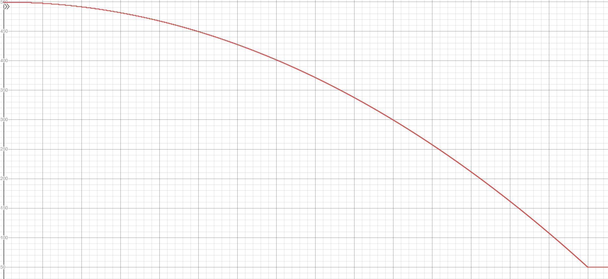
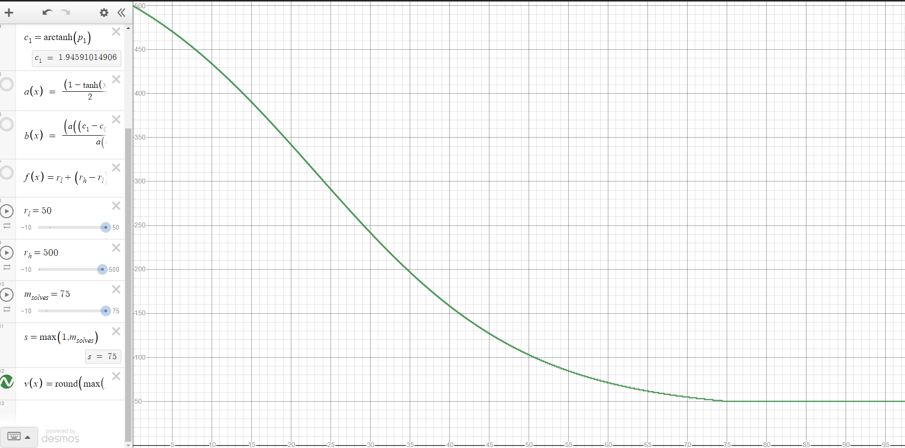

# Dynamic Value Challenges Mod for CTFd

This plugin modifies the dynamic value challenge scoring function to use the same scoring function seen in rCTF.

You can play with the v_minimum, v_initial, and v_decay parameters here: https://www.desmos.com/calculator/w1hh7uqfgc 


## Before


## After


```py
p0 = 0.7
p1 = 0.96
c0 = -math.atanh(p0)
c1 = math.atanh(p1)
a = lambda x: (1 - math.tanh(x)) / 2
b = lambda x: (a((c1 - c0) * x + c0) - a(c1)) / (a(c0) - a(c1))

def get_score(rl, rh, maxSolves, solves):
  s = math.max(1, maxSolves)
  f = lambda x: rl + (rh - rl) * b(x / s)
  return round(math.max(f(solves), f(s)))
value = get_score(challenge.minimum, challenge.initial, challenge.decay, solve_count)

if value < challenge.minimum:
  value = challenge.minimum
value = (((minimum - initial)/(decay**2)) * (solve_count**2)) + initial
value = math.ceil(value)
```

# Installation

**REQUIRES: CTFd >= v1.2.0**

1. Clone this repository to `CTFd/plugins`. It is important that the folder is
   named `dynamic_challenges_mod` so that it loads after `dynamic_challenges` and can modify it.
